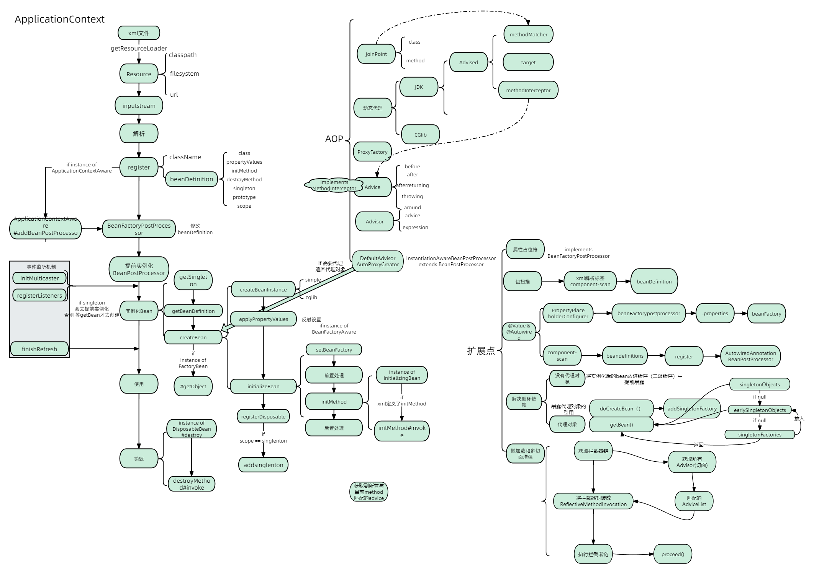

# miniSpring
实现spring核心功能demo

## 关于

**mini-spring**是简化版的spring框架，能帮助你快速熟悉spring源码和掌握spring的核心原理。抽取了spring的核心逻辑，代码极度简化，保留spring的核心功能，如IoC和AOP、资源加载器、事件监听器、类型转换、容器扩展点、bean生命周期和作用域、应用上下文等核心功能。
## 参考
- [《mini-spring》](https://github.com/DerekYRC/mini-spring)

## 可写在简历上的亮点
- IOC的流程
- AOP流程
  - 几种常用的Advice：BeforeAdvice/AfterAdvice/AfterReturningAdvice/ThrowsAdvice...
- 扩展优化
  - 添加包扫描
  - 解决循环依赖（解决方式有很多...可自行多查阅）
  - 支持懒加载和多切面增强
## 简图
