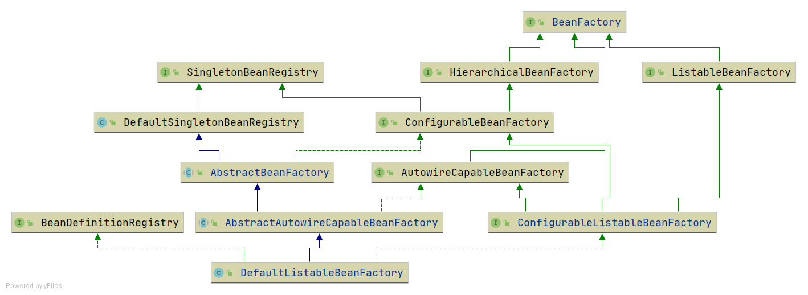
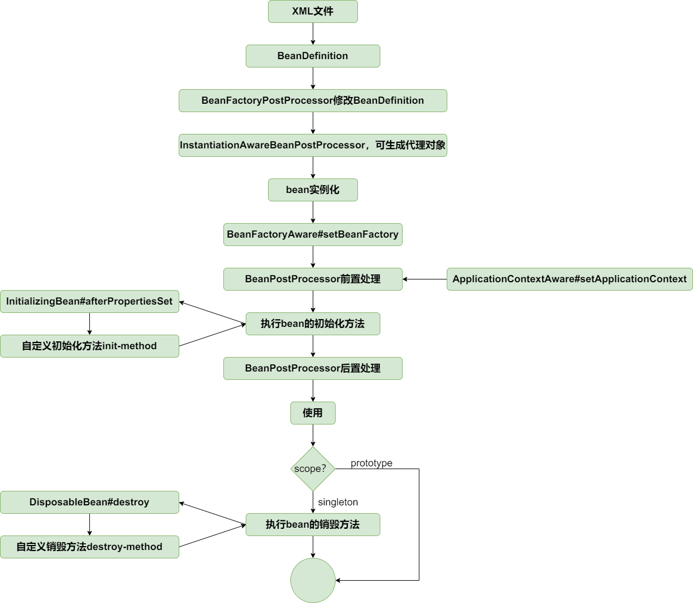

# IOC
## 最简单的bean容器
> 分支：simple-bean-container

定义一个简单的bean容器BeanFactory，内部包含一个map用以保存bean，只有注册bean和获取bean两个方法

## BeanDefinition和BeanDefinitionRegistry
> 分支：instantiation-strategy

主要增加如下类：
- BeanDefinition，顾名思义，用于定义bean信息的类，包含bean的class类型、构造参数、属性值等信息，每个bean对应一个BeanDefinition的实例。简化BeanDefition仅包含bean的class类型。
- BeanDefinitionRegistry，BeanDefinition注册表接口，定义注册BeanDefintion的方法。
- SingletonBeanRegistry及其实现类DefaultSingletonBeanRegistry，定义添加和获取单例bean的方法。

bean容器作为BeanDefinitionRegistry和SingletonBeanRegistry的实现类，具备两者的能力。向bean容器中注册BeanDefintion后，使用bean时才会实例化。


## Bean实例化策略InstantiationStrategy
> 分支：instantiation-strategy

现在bean是在AbstractAutowireCapableBeanFactory.doCreateBean方法中用
beanClass.newInstance()来实例化，仅适用于bean有无参构造函数的情况。

针对bean的实例化，抽象出一个实例化策略的接口InstantiationStrategy，有两个实现类：
- SimpleInstantiationStrategy，使用bean的构造函数来实例化
- CglibSubclassingInstantiationStrategy，使用CGLIB动态生成子类


**Spring Bean的实例化策略**是由InstantiationStrategy接口定义的，根据创建对象情况的不同，提供了三种策略：

- **无参构造方法**：这是最常见的实例化策略，Spring默认的实例化方法就是无参构造函数实例化。例如，我们在xml里定义的 <bean id=\"xxx\" class=\"yyy\"/> 以及用注解标识的bean都是通过默认实例化方法实例化的14。

- **有参构造方法**：如果Bean的定义信息中包含了构造函数的参数，那么Spring会使用有参构造方法来实例化Bean14。

- **工厂方法**：如果Bean的定义信息中指定了工厂方法，那么Spring会调用该工厂方法来实例化Bean14。

## 为bean填充属性
> 分支：populate-bean-with-property-values

在BeanDefinition中增加和bean属性对应的PropertyVales，实例化bean之后，为bean填充属性(AbstractAutowireCapableBeanFactory#applyPropertyValues)。


## 为bean注入bean
> 分支：populate-bean-with-bean

增加BeanReference类，包装一个bean对另一个bean的引用。实例化beanA后填充属性时，若PropertyValue#value为BeanReference，引用beanB，则先去实例化beanB。
由于不想增加代码的复杂度提高理解难度，暂时不支持循环依赖，后面会在高级篇中解决该问题。

## 资源和资源加载器
> 分支：resource-and-resource-loader

Resource是资源的抽象和访问接口，简单写了三个实现类


- FileSystemResource，文件系统资源的实现类
- ClassPathResource，classpath下资源的实现类
- UrlResource，对java.net.URL进行资源定位的实现类

ResourceLoader接口则是资源查找定位策略的抽象，DefaultResourceLoader是其默认实现类


## 在xml文件中定义bean
> 分支：xml-file-define-bean

有了资源加载器，就可以在xml格式配置文件中声明式地定义bean的信息，资源加载器读取xml文件，解析出bean的信息，然后往容器中注册BeanDefinition。

BeanDefinitionReader是读取bean定义信息的抽象接口，XmlBeanDefinitionReader是从xml文件中读取的实现类。BeanDefinitionReader需要有获取资源的能力，且读取bean定义信息后需要往容器中注册BeanDefinition，因此BeanDefinitionReader的抽象实现类AbstractBeanDefinitionReader拥有ResourceLoader和BeanDefinitionRegistry两个属性。

由于从xml文件中读取的内容是String类型，所以属性仅支持String类型和引用其他Bean。后面会讲到属性编辑器PropertyEditor，实现类型转换。

为了方便后面的讲解和功能实现，并且尽量保持和spring中BeanFactory的继承层次一致，对BeanFactory的继承层次稍微做了调整，增加了接口ConfigurableListableBeanFactory和ListableBeanFactory和对应的方法，方法在DefaultListableBeanFactory中实现。



## 应用上下文ApplicationContext
> 分支：application-context

应用上下文ApplicationContext是spring中较之于BeanFactory更为先进的IOC容器，ApplicationContext除了拥有BeanFactory的所有功能外，还支持特殊类型bean如上一节中的BeanFactoryPostProcessor和BeanPostProcessor的自动识别、资源加载、容器事件和监听器、国际化支持、单例bean自动初始化等。

BeanFactory是spring的基础设施，面向spring本身；而ApplicationContext面向spring的使用者，应用场合使用ApplicationContext。

具体实现查看AbstractApplicationContext#refresh方法即可。注意BeanFactoryPostProcessor和BeanPostProcessor的自定识别，这样就可以在xml文件中配置二者而不需要像上一节一样手动添加到容器中了。

从bean的角度看，目前生命周期如下：


## bean的初始化和销毁方法
> 分支：init-and-destroy-method

在spring中，定义bean的初始化和销毁方法有三种方法：
- 在xml文件中制定init-method和destroy-method
- 继承自InitializingBean和DisposableBean
- 在方法上加注解PostConstruct和PreDestroy

第三种通过BeanPostProcessor实现，在扩展篇中实现，本节只实现前两种。

针对第一种在xml文件中指定初始化和销毁方法的方式，在BeanDefinition中增加属性initMethodName和destroyMethodName。

初始化方法在AbstractAutowireCapableBeanFactory#invokeInitMethods执行。DefaultSingletonBeanRegistry中增加属性disposableBeans保存拥有销毁方法的bean，拥有销毁方法的bean在AbstractAutowireCapableBeanFactory#registerDisposableBeanIfNecessary中注册到disposableBeans中。为了确保销毁方法在虚拟机关闭之前执行，向虚拟机中注册一个钩子方法，查看AbstractApplicationContext#registerShutdownHook（非web应用需要手动调用该方法）。当然也可以手动调用ApplicationContext#close方法关闭容器。

到此为止，bean的生命周期如下：


## Aware接口
> 分支：aware-interface

Aware是感知、意识的意思，Aware接口是标记性接口，其实现子类能感知容器相关的对象。常用的Aware接口有BeanFactoryAware和ApplicationContextAware，分别能让其实现者感知所属的BeanFactory和ApplicationContext。

让实现BeanFactoryAware接口的类能感知所属的BeanFactory，实现比较简单，查看AbstractAutowireCapableBeanFactory#initializeBean前三行。

实现ApplicationContextAware的接口感知ApplicationContext，是通过BeanPostProcessor。由bean的生命周期可知，bean实例化后会经过BeanPostProcessor的前置处理和后置处理。定义一个BeanPostProcessor的实现类ApplicationContextAwareProcessor，在AbstractApplicationContext#refresh方法中加入到BeanFactory中，在前置处理中为bean设置所属的ApplicationContext。

至止，bean的生命周期如下：


## bean作用域，增加prototype的支持
> 分支：prototype-bean

每次向容器获取prototype作用域bean时，容器都会创建一个新的实例。在BeanDefinition中增加描述bean的作用域的字段scope/singleton/prototype，创建prototype作用域bean时（AbstractAutowireCapableBeanFactory#doCreateBean），不往singletonObjects中增加该bean。prototype作用域bean不执行销毁方法，查看AbstractAutowireCapableBeanFactory#registerDisposableBeanIfNecessary方法。


至止，bean的生命周期如下：


**Spring框架中有以下几种作用域**：

- **Singleton**：这是Spring的默认作用域。在这个作用域中，Spring容器只会创建一个实例，所有对该bean的请求都将返回这个唯一的实例。这种作用域非常适合对于无状态的Bean，比如工具类或服务类。

- **Prototype**：每次请求都会创建一个新的Bean实例，适合对于需要维护状态的Bean。

- **Request**：在Web应用中，为每个HTTP请求创建一个Bean实例。适合在一个请求中需要维护状态的场景，如跟踪用户行为信息。

- **Session**：在Web应用中，为每个HTTP会话创建一个Bean实例。适合需要在多个请求之间维护状态的场景，如用户会话。

- **Application**：在整个Web应用期间，创建一个Bean实例。适合存储全局的配置数据等。

- **WebSocket**：在每个WebSocket会话中创建一个Bean实例。适合WebSocket通信场景。

## FactoryBean
> 分支：factory-bean

FactoryBean是一种特殊的bean，当向容器获取该bean时，容器不是返回其本身，而是返回其FactoryBean#getObject方法的返回值，可通过编码方式定义复杂的bean。

实现逻辑比较简单，当容器发现bean为FactoryBean类型时，调用其getObject方法返回最终bean。当FactoryBean#isSingleton==true，将最终bean放进缓存中，下次从缓存中获取。改动点见AbstractBeanFactory#getBean。

注意区分FactoryBean和BeanFactory:  
`BeanFactory`和`FactoryBean`在Spring框架中都扮演着重要的角色，但它们的功能和用途有所不同。

**BeanFactory**：
- `BeanFactory`是Spring容器的顶级接口，给具体的IOC容器的实现提供了规范。
- 它是Spring框架的基础，提供了依赖注入和控制反转等重要特性。
- `BeanFactory`负责根据配置信息创建和维护Bean对象的生命周期。
- 它使用了延迟初始化和懒加载的策略，只有在需要时才会创建Bean实例。

**FactoryBean**：
- `FactoryBean`是一个特殊的Bean，它实现了Spring的`FactoryBean`接口。
- 通过实现这个接口，我们可以自定义Bean的创建过程，灵活地控制Bean的实例化和配置。
- `FactoryBean`的实现类是一个工厂，它负责产生其他Bean的实例。
- 当我们在Spring配置文件中定义一个`FactoryBean`时，实际上创建的是这个工厂Bean本身。
- 当需要使用这个Bean时，Spring容器会调用`FactoryBean`的`getObject()`方法来获取由工厂Bean产生的实例对象。


## 容器事件和时间监听器
> 分支：event-and-event-listener

ApplicationContext容器提供了完善的时间发布和时间监听功能。

ApplicationEventMulticaster接口是注册监听器和发布事件的抽象，AbstractApplicationContext包含其实现类实例作为其属性，使得ApplicationContext容器具有注册监听器和发布事件的能力。在AbstractApplicationContext#refresh方法中，会实例化ApplicationEventMulticaster、注册监听器并发布容器刷新事件ContextRefreshedEvent；在AbstractApplicationContext#doClose方法中，发布容器关闭事件ContextClosedEvent。

## 切点表达式
> 分支：pointcut-expression

Joinpoint，织入点，指需要执行代理操作的某个类的某个方法(仅支持方法级别的JoinPoint)；Pointcut是JoinPoint的表述方式，能捕获JoinPoint。

最常用的切点表达式是AspectJ的切点表达式。需要匹配类，定义ClassFilter接口；匹配方法，定义MethodMatcher接口。PointCut需要同时匹配类和方法，包含ClassFilter和MethodMatcher，AspectJExpressionPointcut是支持AspectJ切点表达式的PointCut实现，简单实现仅支持execution函数。


## 切点表达式
> 分支：jdk-dynamic-proxy

AopProxy是获取代理对象的抽象接口，JdkDynamicAopProxy的基于JDK动态代理的具体实现。TargetSource，被代理对象的封装。MethodInterceptor，方法拦截器，是AOP Alliance的"公民"，顾名思义，可以拦截方法，可在被代理执行的方法前后增加代理行为。


## 基于CGLIB的动态代理
> 分支：cglib-dynamic-proxy

基于CGLIB的动态代理实现逻辑也比较简单，查看CglibAopProxy。与基于JDK的动态代理在运行期间为接口生成对象的代理对象不同，基于CGLIB的动态代理能在运行期间动态构建字节码的class文件，为类生成子类，因此被代理类不需要继承自任何接口。


## AOP代理工厂
> 分支：proxy-factory

增加AOP代理工厂ProxyFactory，由AdvisedSupport#proxyTargetClass属性决定使用JDK动态代理还是CGLIB动态代理。

## 几种常用的Advice：BeforeAdvice/AfterAdvice/AfterReturningAdvice/ThrowsAdvice...
> 分支： common-advice

Spring将AOP联盟中的Advice细化出各种类型的Advice，常用的有BeforeAdvice/AfterAdvice/AfterReturningAdvice/ThrowsAdvice，我们可以通过扩展MethodInterceptor来实现。

- [x] BeforeAdvice         –> @Before
- [x] AfterAdvice          –> @After          try finally
- [x] AfterReturningAdvice –> @AfterReturning return
- [x] ThrowsAdvice         –> @AfterThrowing  try catch
- [x] AroundAdvice         –> @Around         实现MethodInterceptor接口即可

## PointcutAdvisor：Pointcut和Advice的组合
> 分支：pointcut-advisor

Advisor是包含一个Pointcut和一个Advice的组合，Pointcut用于捕获JoinPoint，Advice决定在JoinPoint执行某种操作。实现了一个支持aspectj表达式的AspectJExpressionPointcutAdvisor。


## 动态代理融入bean生命周期
> 分支：auto-proxy

结合前面讲解的bean的生命周期，BeanPostProcessor处理阶段可以修改和替换bean，正好可以在此阶段返回代理对象替换原对象。不过我们引入一种特殊的BeanPostProcessor——InstantiationAwareBeanPostProcessor，如果InstantiationAwareBeanPostProcessor处理阶段返回代理对象，会导致短路，不会继续走原来的创建bean的流程，具体实现查看AbstractAutowireCapableBeanFactory#resolveBeforeInstantiation。

DefaultAdvisorAutoProxyCreator是处理横切逻辑的织入返回代理对象的InstantiationAwareBeanPostProcessor实现类，当对象实例化时，生成代理对象并返回。

至此，bean的生命周期如下：


## PropertyPlaceholderConfigurer
> 分支：property-placeholder-configurer

经常需要将配置信息配置在properties文件中，然后在XML文件中以占位符的方式引用。

实现思路很简单，在bean实例化之前，编辑BeanDefinition，解析XML文件中的占位符，然后用properties文件中的配置值替换占位符。而BeanFactoryPostProcessor具有编辑BeanDefinition的能力，因此PropertyPlaceholderConfigurer继承自BeanFactoryPostProcessor。

## 包扫描
> 分支：package-scan

结合bean的生命周期，包扫描只不过是扫描特定注解的类，提取类的相关信息组装成BeanDefinition注册到容器中。

在XmlBeanDefinitionReader中解析**```<context:component-scan />```**标签，扫描类组装BeanDefinition然后注册到容器中的操作在ClassPathBeanDefinitionScanner#doScan中实现。

## @Value注解
> 分支：value-annotation

注解@Value和@Autowired通过BeanPostProcessor处理。InstantiationAwareBeanPostProcessor增加postProcessPropertyValues方法，在bean实例化之后设置属性之前执行，查看AbstractAutowireCapableBeanFactory#doCreateBean方法。

增加AutowiredAnnotationBeanPostProcessor用于处理注解@Value，@Autowired的处理在下一节实现，在ClassPathBeanDefinitionScanner#doScan将其添加到容器中。查看AutowiredAnnotationBeanPostProcessor#postProcessPropertyValues，其中字符解析器StringValueResolver在PropertyPlaceholderConfigurer中添加到BeanFactory中。

## @Autowired注解
> 分支：autowired-annotation

@Autowired注解的处理见AutowiredAnnotationBeanPostProcessor#postProcessPropertyValues

## bug fix：没有为代理bean设置属性（discovered and fixed by @kerwin89）
> 分支: populate-proxy-bean-with-property-values

问题现象：没有为代理bean设置属性

问题原因：织入逻辑在InstantiationAwareBeanPostProcessor#postProcessBeforeInstantiation中执行，而该方法如果返回非null，会导致"短路"，不会执行后面的设置属性逻辑。因此如果该方法中返回代理bean后，不会为代理bean设置属性。

修复方案：跟spring保持一致，将织入逻辑迁移到BeanPostProcessor#postProcessAfterInitialization，即将DefaultAdvisorAutoProxyCreator#postProcessBeforeInstantiation的内容迁移到DefaultAdvisorAutoProxyCreator#postProcessAfterInitialization中。

顺便完善spring的扩展机制，为InstantiationAwareBeanPostProcessor增加postProcessAfterInstantiation方法，该方法在bean实例化之后设置属性之前执行。

至此，bean的生命周期比较完整了，如下：

